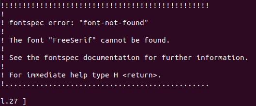

生成PDF
=======

Sphinx生成PDF的过程是先将rst转换为tex, 再生成PDF.

-   首先安装tex环境

Ubuntu:

    .. code-block:: bash

        sudo apt-get install latexmk texlive-xetex 

-   在\ ``conf.py``\ 中设置\ ``latex_elements``\ 参数, 同时也可以设置\ ``latex_documents``\ 参数设置文档

Example:

    .. code:: python

        latex_elements = {
            # The paper size ('letterpaper' or 'a4paper').
            #
            'papersize': 'a4paper',

            # The font size ('10pt', '11pt' or '12pt').
            #
            'pointsize': '10pt',

            # Additional stuff for the LaTeX preamble.
            #
            'preamble': '',

            # Latex figure (float) alignment
            #
            'figure_align': 'htbp',
        }

    .. tip::
      
        简便的方法是将\ ``latex_elements``\ 中注释的字段放开注释, 并设置相应的值.

-   编译

执行以下命令编译生成PDF:

.. code:: shell

    # 将rst转换为tex, 并将tex生成PDF
    make latexpdf

编译之后, 在\ ``build/latex``\ 下就可以查看到生成的PDF文档.

问题总结
--------

在编译的过程中, 可能会遇到错误\ ``fontspec error: "font-not-found"``\ , 提示没有找到指定的字体.

这是因为我们的系统中没有安装相应的字体.
例如, 上图中提示没有找到\ ``FreeSerif``\ 字体, 使用如下命令安装: 

.. code-block:: cpp

    sudo apt-get install fonts-freefont-otf

